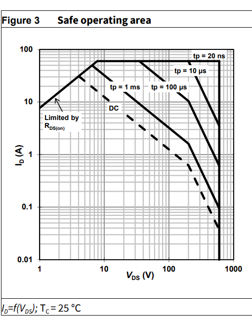

https://www.integrasources.com/blog/bldc-motor-controller-design-principles/

A typical BLDC motor controller has a half-bridge or half-H bridge circuit. Unlike an H bridge, this circuit configuration has only two switches - one high-side and one low-side transistor.

Typically, a sinusoidal brushless motor controller circuit uses pulse-width modulation (PWM). It helps regulate the current injected into the rotor’s windings and run the commutation process more smoothly and efficiently. This applies especially to closed-loop controllers that get feedback on the output signal and adjust the input power by varying the duty cycle.

When designing a BLDC motor controller, engineers can use different current switching, including trapezoidal and sinusoidal commutation. The names relate to the signal waveforms. 

The trapezoidal commutation allows two windings out of three to stay energized simultaneously. In the sinusoidal approach, the phase shift complies with the law of sines, so current switching between the phases becomes smoother. 

SPI between hall and mcu

https://ams.com/documents/20143/36005/AS5147_DS000307_3-00.pdf

magnetic encoder, no moving parts

- 0.02197 deg resolution

4 GaNs

-IGO60R070D1 
-IGOT60R070D1 
-IGLD60R070D1 
-IGT60R070D1 

we will use IGT60R070D1

](image.png)

Vgs = 5

turn on delay = 10ns
turn off delay = 14ns

GaN driver-

Turn on, off  propagation delay= 75ns
impulse blanking time = 40ns(min time pulse on)

Max frequency= 1/((10+14+75+75+40)*10^-9) = 4.673MHz

unoR4 minima: 48Mhz
9 bit resolution -> 93.75kHz

STM32G491RE ARM Microcontroller

