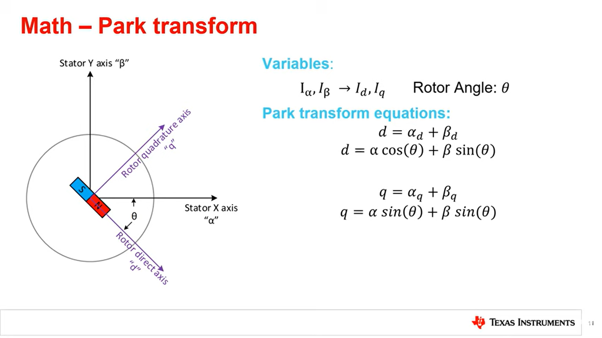

https://www.integrasources.com/blog/bldc-motor-controller-design-principles/

A typical BLDC motor controller has a half-bridge or half-H bridge circuit. Unlike an H bridge, this circuit configuration has only two switches - one high-side and one low-side transistor.

Typically, a sinusoidal brushless motor controller circuit uses pulse-width modulation (PWM). It helps regulate the current injected into the rotor’s windings and run the commutation process more smoothly and efficiently. This applies especially to closed-loop controllers that get feedback on the output signal and adjust the input power by varying the duty cycle.

When designing a BLDC motor controller, engineers can use different current switching, including trapezoidal and sinusoidal commutation. The names relate to the signal waveforms. 

The trapezoidal commutation allows two windings out of three to stay energized simultaneously. In the sinusoidal approach, the phase shift complies with the law of sines, so current switching between the phases becomes smoother. 

SPI between hall and mcu

https://ams.com/documents/20143/36005/AS5147_DS000307_3-00.pdf

magnetic encoder, no moving parts

- 0.02197 deg resolution
- 14 bit resolution

Compare with 

Similar Vdsmax and Ids max

80kHz

We can use 200kHz similar switching loses

150% increase in frequency

60% reduction in ripple currrent

https://www.controleng.com/articles/understanding-the-effect-of-pwm-when-controlling-a-brushless-dc-motor/

Maerz, Martin & Heckel, Thomas & Rettner, Cornelius. (2015). Fundamental Efficiency Limits in Power Electronic Systems. 10.1109/INTLEC.2015.7572399. 

4 GaNs

-IGO60R070D1 
-IGOT60R070D1 
-IGLD60R070D1 
-IGT60R070D1 

we will use IGT60R070D1

](image.png)

Vgs = 5

turn on delay = 10ns
turn off delay = 14ns

GaN driver-

Turn on, off  propagation delay= 75ns
impulse blanking time = 40ns(min time pulse on)

A gate driver is a power amplifier that accepts a low power input from a controller IC and produces the appropriate high current gate drive for a power device. It is used when a PWM controller cannot provide the output current required to drive the gate capacitance of the associated power device.

In motor drive applications, such as those used for robotics, drones, automotive, and industrial machinery, high switching frequencies enable higher power density, increased efficiency, higher performance, and reduced EMI. These benefits can make GaN-based motor drive systems more compact, reliable, and cost-effective than silicon-based systems.

Max frequency= 1/((10+14+75+75+40)*10^-9) = 4.673MHz

unoR4 minima: 48Mhz
9 bit resolution -> 93.75kHz
~8 bit resolution -> 200kHz (240)
voltage control resolution= 0.234375V @60V and 0.15625V @ 40V
PI or PID

STM32G491RE ARM Microcontroller 170MHz 850(more than 9 bits accuracy)

or XMC4800-F100K2048 AA 144MHz 720 (more than 9 bit accuracy)
https://www.infineon.com/cms/en/product/microcontroller/32-bit-industrial-microcontroller-based-on-arm-cortex-m/32-bit-xmc4000-industrial-microcontroller-arm-cortex-m4/
(recommended for GaN and gate driver)

or AURIX 
https://www.infineon.com/cms/en/product/microcontroller/32-bit-tricore-microcontroller/

or PSOC
https://www.infineon.com/cms/en/product/microcontroller/32-bit-psoc-arm-cortex-microcontroller/

input 48 to 60V min. 40V
motor min voltage: 13.6V
motor max voltage: 21V
4-5s

19/40=0.475, 19/60=0.3167

max Ig= 10mA

off the shelf code:

very good open source project using field oriented control:

https://github.com/simplefoc/Arduino-FOC
https://www.youtube.com/watch?v=Y5kLeqTc6Zk
https://www.youtube.com/watch?v=zSdetJsSeNw
https://www.youtube.com/watch?v=Nhy6g9wGHow

nice animation:
https://www.youtube.com/watch?v=YPD1_rcXBIE
 
good: normal motor trap control or sine control
https://github.com/byDagor/Janus-Controller

https://github.com/maakbaas/mbldc

https://github.com/qwertpas/O32controller

https://www.youtube.com/watch?v=VdkloigaxZo

https://github.com/SheffieldEcoMotorsports/motor-controller (with pid)

ref:
https://simple-circuit.com/arduino-sensorless-bldc-motor-controller-esc/

https://www.instructables.com/BLDC-Motor-Control-with-Arduino-salvaged-HD-motor/

https://simple-circuit.com/arduino-sensorless-brushless-motor-bldc/

https://simple-circuit.com/arduino-bldc-brushless-dc-motor-control/

circuit:

theory:

https://www.youtube.com/watch?v=_6-_jvZe7iA